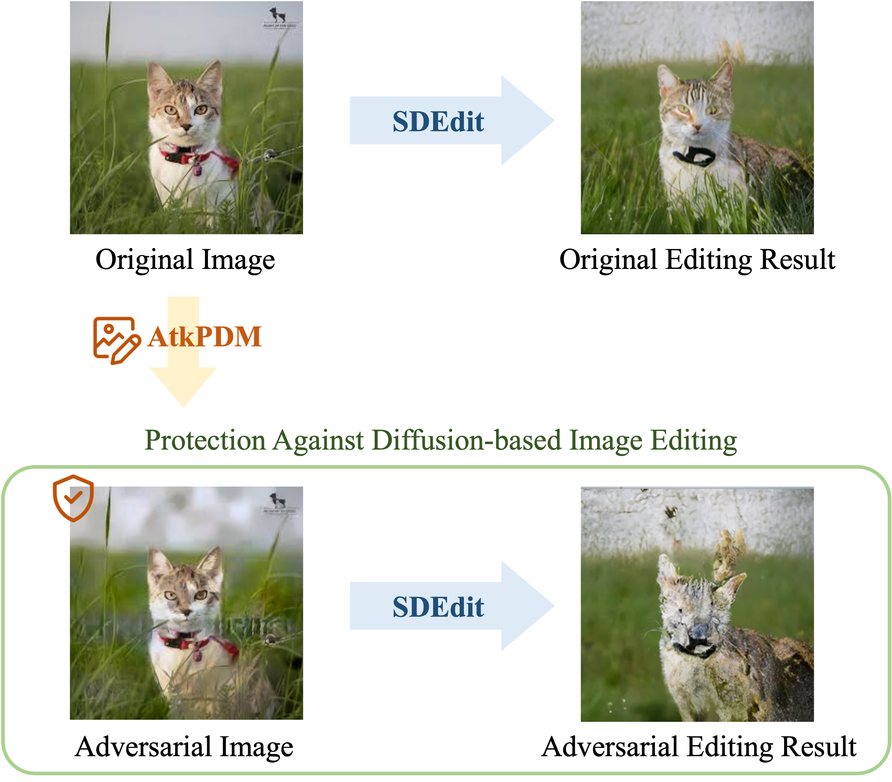

# Pixel Is Not A Barrier: An Effective Evasion Attack for Pixel-Domain Diffusion Models (AtkPDM)

[](https://www.python.org/downloads/release/python-310/)
[](https://lbesson.mit-license.org/)
[](https://arxiv.org/abs/2408.11810) 

***Association for the Advancement of Artificial Intelligence (AAAI) 2025***

**Author:** [Chun-Yen Shih](https://www.linkedin.com/in/chun-yen-shih-590810207/?originalSubdomain=tw), [Li-Xuan Peng](https://alexpeng517.github.io/), [Jia-Wei Liao](https://jwliao1209.github.io/),[Ernie Chu](https://www.cs.jhu.edu/~schu23/), [Cheng-Fu Chou](https://www.csie.ntu.edu.tw/~ccf/), [Jun-Cheng Chen](https://homepage.citi.sinica.edu.tw/pages/pullpull/)

## :wrench: Setup
To set up the virtual environment and install the required packages, use the following commands:
```
virtualenv --python=python3.10 atkpdm
source atkpdm/bin/activate
pip install -r requirements.txt
```

## :rocket: Problem Overview
Diffusion-based image editing can generate high-quality image variation based on the clean input image. However, by adding carefully crafted perturbation to the clean image, the diffusion process will be disrupted, producing a corrupted image or unrelated image semantics to the original image.




## :bulb: Proposed Pipeline
Starting from the latent, $\mathbf{z}^\text{adv}$, of the initial adversarial image, we first decode back to pixel-domain to perform forward diffusion with both $\mathbf{x}$ and $\mathbf{x}^\text{adv}$ and feed them to frozen victim UNet. We then extract the feature representation of the middle block in UNet to calculate our $L_\text{attack}$, aiming to distract the recognition of image semantics. We also calculate our $L_\text{fidelity}$ in pixel-domain to constrain the optimization. Finally, the $\mathbf{z}^\text{adv}$ is being alternatively updated by loss gradients.


## :dart: Citation
If you use this code, please cite the following:
```bibtex
@inproceedings{shih2024atkpdm,
  title     = {Pixel Is Not A Barrier: An Effective Evasion Attack for Pixel-Domain Diffusion Models},
  author    = {Chun-Yen Shih and Li-Xuan Peng and Jia-Wei Liao and Ernie Chu and Cheng-Fu Chou and Jun-Cheng Chen},
  booktitle = {Annual AAAI Conference on Artificial Intelligence (AAAI)},
  year      = {2025},
}
```
